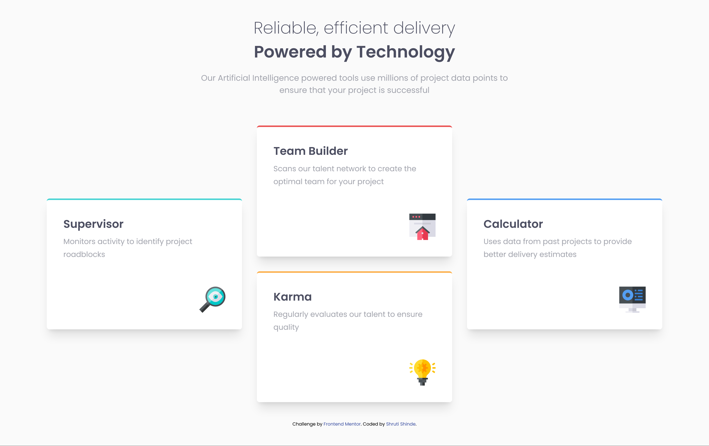

# Frontend Mentor - Four card feature section solution

This is a solution to the [Four card feature section challenge on Frontend Mentor](https://www.frontendmentor.io/challenges/four-card-feature-section-weK1eFYK). Frontend Mentor challenges help you improve your coding skills by building realistic projects. 

## Table of contents

- [Frontend Mentor - Four card feature section solution](#frontend-mentor---four-card-feature-section-solution)
  - [Table of contents](#table-of-contents)
  - [Overview](#overview)
    - [The challenge](#the-challenge)
    - [Screenshot](#screenshot)
    - [Links](#links)
  - [My process](#my-process)
    - [Built with](#built-with)
    - [What I learned](#what-i-learned)
  - [Author](#author)

**Note: Delete this note and update the table of contents based on what sections you keep.**

## Overview

### The challenge

Users should be able to:

- View the optimal layout for the site depending on their device's screen size

### Screenshot



### Links

- Solution URL: [https://github.com/ShrutiShinde418/FrontendMentor2/tree/main/four-card-feature-section](https://github.com/ShrutiShinde418/FrontendMentor2/tree/main/four-card-feature-section)
- Live Site URL: [https://four-card-feature-self.vercel.app/](https://four-card-feature-self.vercel.app/)

## My process

### Built with

- Semantic HTML5 markup
- Tailwind CSS
- CSS Grid

### What I learned

- Tailwind CSS

```css
.cards {
  grid-template-areas: ". card-2 ." "card-1 card-2 card-3" "card-1 card-4 card-3" ". card-4 .";
}

.border-cyan {
  grid-area: card-1;
}
```

## Author

- Frontend Mentor - [@ShrutiShinde418](https://www.frontendmentor.io/profile/ShrutiShinde418)
